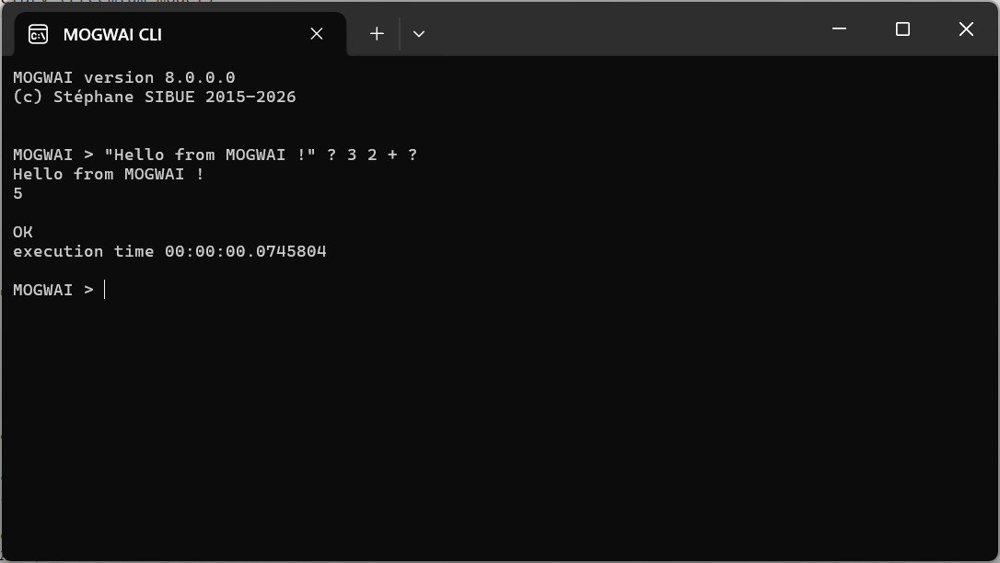
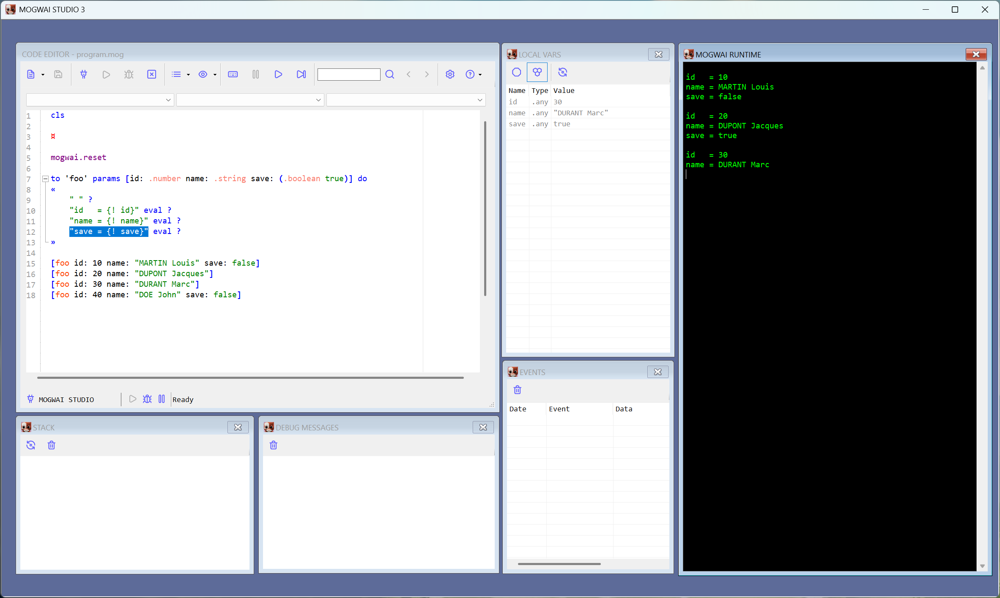
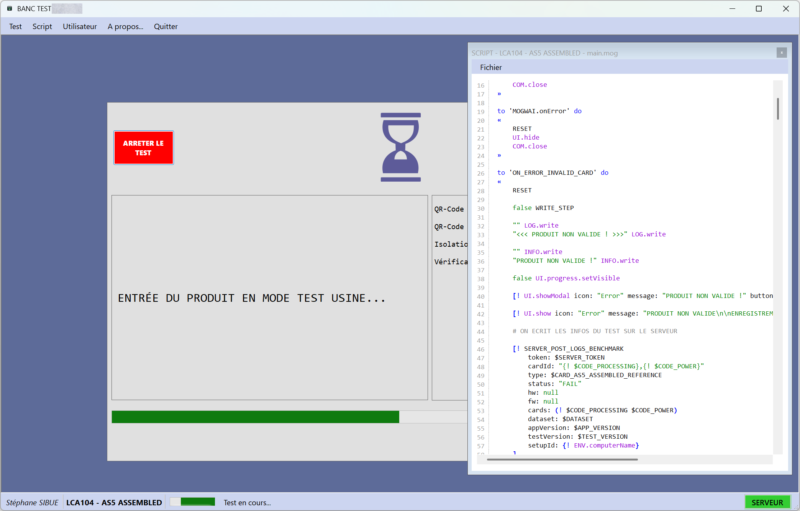
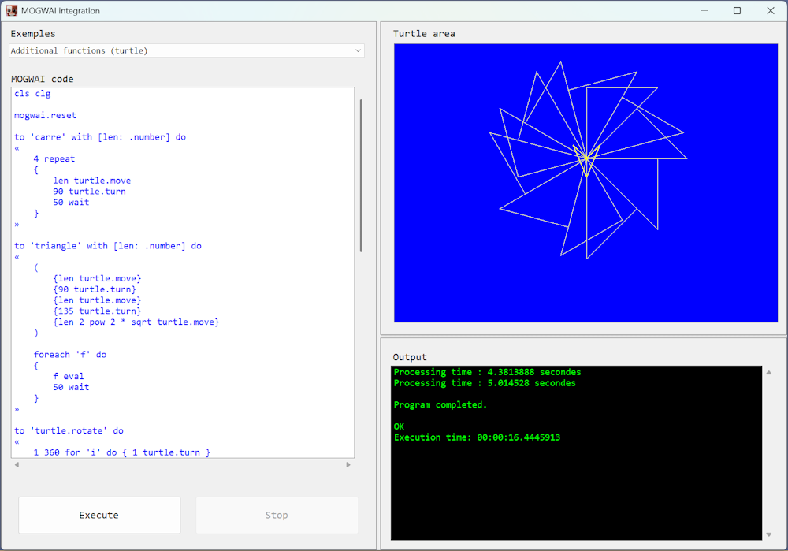
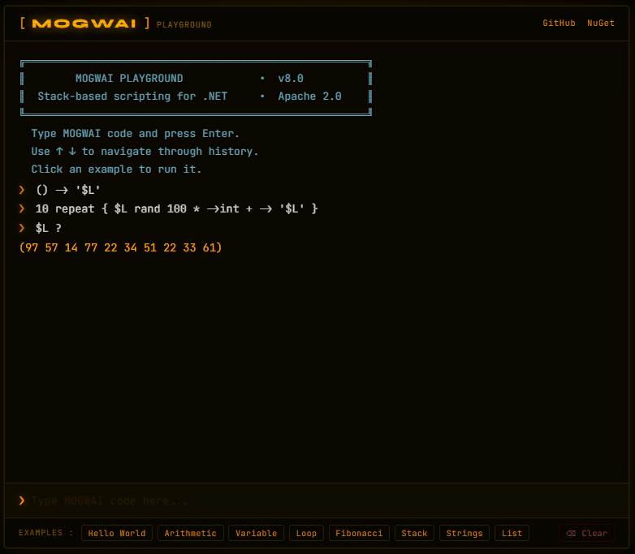

# [MOGWAI](https://www.mogwai.eu.com) - A powerful stack-based RPN scripting language for industrial IoT automation, embedded systems, and .NET applications.


[](LICENSE)
[](https://dotnet.microsoft.com/)
[](https://www.nuget.org/packages/MOGWAI/)

**10 years of development** • **240+ built-in functions** • **Battle-tested in production** • **Open Source**
---
## What is MOGWAI?

MOGWAI is a modern implementation of RPN (Reverse Polish Notation) designed for industrial automation, IoT applications, and embedded systems. Inspired by the legendary HP calculators (HP 28S, HP 48), MOGWAI brings the elegance and power of stack-based programming to the .NET ecosystem.

### Key Features

- **Stack-Based RPN Syntax** - Clean, unambiguous, no operator precedence
- **240+ Built-in Functions** - Math, strings, lists, files, HTTP, BLE, and more
- **Async/Await Support** - Modern asynchronous execution
- **IoT Ready** - Bluetooth Low Energy, serial ports, GPIO
- **Industrial Grade** - 3 years in production environments
- **Extensible** - Easy integration with .NET applications
- **Cross-Platform** - Windows, Linux, macOS, Android, iOS
- **Visual Debugging** - MOGWAI STUDIO integration (coming soon)

---

## The MOGWAI Ecosystem

### MOGWAI Runtime (Open Source)

The core scripting engine, available as a NuGet package. Embed MOGWAI in your .NET applications.

- **License:** Apache 2.0
- **Package:** [MOGWAI on NuGet](https://www.nuget.org/packages/MOGWAI/)
- **Status:** Production ready

### MOGWAI CLI (Open Source)

Command-line interface for running MOGWAI scripts and interactive REPL sessions.

- **License:** Apache 2.0
- **Repository:** [MOGWAI CLI](https://github.com/Sydney680928/mogwai/tree/main/examples/Console/ConsoleExample)
- **Status:** Functional

### MOGWAI STUDIO (Coming Soon)

Visual IDE for MOGWAI development with debugging, breakpoints, and code editing.

- **License:** Proprietary (Freemium model)
- **Status:** In active development
- **Features:** Visual debugger, syntax highlighting, project management
- **Release:** TBA

---

## Quick Start

### Installation

Install the MOGWAI runtime via NuGet:

```bash
dotnet add package MOGWAI
```

### Hello World

```csharp
using MOGWAI.Engine;
using MOGWAI.Interfaces;

var engine = new MogwaiEngine("MyApp");
engine.Delegate = this; // Your class implementing IDelegate

var result = await engine.RunAsync(@"
    \"Hello from MOGWAI!\" ?
    2 3 + ?
", debugMode: false);
```



### MOGWAI Language Example

```mogwai
# Variables
42 -> '$answer'
"Hello World" -> '$greeting'

# Functions
to 'square' with [n: .number] do
{
    n n *
}

# Lists
(1 2 3 4 5) foreach 'n' transform { n square } -> '$result'
$result ? # Outputs the list of squares (1 4 9 16 25)

# Records
[name: "MOGWAI", version: "8.0"] -> 'info'

# Conditionals
if (answer 40 >) then
{
    "Answer is greater than 40" ?
}
```

---

## Build from Source

### Prerequisites

- [.NET SDK 9.0](https://dotnet.microsoft.com/download) or later
- Git

### Clone and Build

```bash
# Clone repository
git clone https://github.com/Sydney680928/mogwai.git
cd mogwai

# Restore dependencies
dotnet restore src/MOGWAI/MOGWAI.sln

# Build
dotnet build src/MOGWAI/MOGWAI.sln --configuration Release

# Pack (optional)
dotnet pack src/MOGWAI/MOGWAI.sln --configuration Release
```

The compiled assembly will be in `src/MOGWAI/MOGWAI/bin/Release/net9.0/`.

### Project Structure

```
mogwai/
├── src/
│   └── MOGWAI/
│       ├── MOGWAI.sln          # Main solution
│       └── MOGWAI/
│           ├── Engine/         # Core runtime engine
│           ├── Objects/        # MOGWAI object types
│           ├── Primitives/     # Built-in functions (240+ primitives)
│           ├── Interfaces/     # Public interfaces (IDelegate, IPlugin)
│           └── Exceptions/     # Exception types
├── docs/
│   └── EN/
│       ├── MOGWAI_EN.md                      # Language reference
│       ├── MOGWAI_FUNCTIONS_EN.md            # Function reference
│       └── MOGWAI_INTEGRATION_GUIDE_EN.md    # Integration guide
├── images/                     # Screenshots and media
├── LICENSE                     # Apache 2.0 license
├── NOTICE                      # Copyright notice
└── README.md                   # This file
```

---

## Documentation

### Complete Guides

- **[Language Reference](https://github.com/Sydney680928/mogwai/tree/main/docs/EN/MOGWAI_EN.md)** - Complete MOGWAI language guide
- **[Function Reference](https://github.com/Sydney680928/mogwai/tree/main/docs/EN/MOGWAI_FUNCTIONS_EN.md)** - All 240+ built-in functions
- **[Integration Guide](https://github.com/Sydney680928/mogwai/tree/main/docs/EN/MOGWAI_INTEGRATION_GUIDE_EN.md)** - How to integrate MOGWAI in your .NET apps

### Examples

Examples are available :

- **[MOGWAI CLI](https://github.com/Sydney680928/mogwai/tree/main/examples/Console)** - Command-line interface and REPL
- **[WinForms Example](https://github.com/Sydney680928/mogwai/tree/main/examples/WinForms)** - Turtle graphics with MOGWAI
- **[MAUI Example](https://github.com/Sydney680928/mogwai/tree/main/examples/MAUI)** - Cross-platform mobile app
- **[Blazor Example](https://github.com/Sydney680928/mogwai/tree/main/examples/Blazor)** - Blazor WASM app

### Changelog

See [CHANGELOG.md](CHANGELOG.md) for a detailed history of changes.

**Latest Release:** [v8.0.1](https://github.com/Sydney680928/mogwai/releases/tag/v8.0.1) - 2026-02-17

---

## MOGWAI STUDIO (Coming Soon)



MOGWAI STUDIO is a visual IDE for MOGWAI development currently in active development.

### Planned Features

- **Visual Debugger** - Set breakpoints, step through code
- **Syntax Highlighting** - Color-coded MOGWAI syntax
- **Variable Inspector** - Examine variables in real-time
- **Stack Visualization** - See the stack state at any point
- **Project Management** - Organize scripts and modules
- **Network Debugging** - Debug remote MOGWAI runtimes
- **Code Completion** - IntelliSense for MOGWAI functions

### Availability

**Status:** In development  
**Release Model:** Freemium (Free version + Pro version)  
**Price:** Pro version planned at €29 (one-time purchase)  
**Distribution:** Gumroad + installer package  

Stay tuned for updates on [mogwai.eu.com](https://www.mogwai.eu.com)!

---

## Use Cases

### Industrial IoT Automation

```mogwai
# Read sensor via BLE
"AA:BB:CC:DD:EE:FF" ble.connect -> 'device'
device "temperature" ble.read -> 'temp'

# Control based on value
if (temp 25 >) then
{
    "fan" gpio.on
}
```



[Use Case #1 — Electronic Board Test Bench](docs/EN/use-cases/use-case-01-test-bench.md)

### Embedded Applications

```mogwai
# WinForms turtle graphics
100 turtle.forward
90 turtle.right
100 turtle.forward
"Square complete!" ?
```



### Blazor WASM Applications



You can test it live on [Blazor REPL](https://sydney680928.github.io/MOGWAI/)
---

## Roadmap

### Version 8.0 (Released)

- Complete rewrite with namespace organization
- 240+ primitives
- Apache 2.0 open source license
- Published on NuGet
- .NET 9.0 support
- Complete documentation

### Version 8.1 (In Progress)

- MOGWAI STUDIO IDE (beta)
- Enhanced debugging protocol
- Plugin system improvements
- Additional examples

### Future Plans

- MOGWAI STUDIO official release
- Community plugins marketplace
- Additional language integrations
- Performance optimizations
- Extended IoT function library

---

## Contributing

Contributions are welcome! Here's how you can help:

### Reporting Issues

Found a bug or have a feature request? Please open an issue on GitHub:

- **Bug Reports:** Use the bug report template
- **Feature Requests:** Describe the use case and expected behavior
- **Questions:** Use GitHub Discussions

### Contributing Code

1. Fork the repository
2. Create a feature branch (`git checkout -b feature/amazing-feature`)
3. Make your changes
4. Commit with clear messages (`git commit -m 'Add amazing feature'`)
5. Push to your fork (`git push origin feature/amazing-feature`)
6. Open a Pull Request

### Code Style

- Follow existing code conventions
- Add XML documentation comments for public APIs
- Keep functions focused and well-named

### Testing

While we don't have formal unit tests, please ensure:

- Your changes compile without warnings
- Existing examples still work
- Add example scripts demonstrating new features

---

## Why MOGWAI?

### Born from Real Needs

Created in 2015 to simulate Bluetooth Low Energy devices for IoT testing. Over 10 years, MOGWAI evolved into a full-featured scripting language used in industrial automation.

### Battle-Tested

- **3 years in production** - Industrial environments
- **Real-world IoT** - Astronomical clocks for public lighting
- **Thousands of scripts** - Executed in field deployments

### HP Calculator Heritage

Inspired by the legendary HP 28S and HP 48 calculators, MOGWAI brings RPN elegance to modern software:

- **Clear semantics** - No operator precedence confusion
- **Stack-based** - Natural for complex calculations
- **Composable** - Build complex operations from simple parts

---

## License

### MOGWAI Runtime & CLI

**Apache License 2.0**

```
Copyright 2015-2026 Stéphane Sibué

Licensed under the Apache License, Version 2.0 (the "License");
you may not use this file except in compliance with the License.
You may obtain a copy of the License at

    http://www.apache.org/licenses/LICENSE-2.0

Unless required by applicable law or agreed to in writing, software
distributed under the License is distributed on an "AS IS" BASIS,
WITHOUT WARRANTIES OR CONDITIONS OF ANY KIND, either express or implied.
See the License for the specific language governing permissions and
limitations under the License.
```

See [LICENSE](LICENSE) and [NOTICE](NOTICE) for details.

### MOGWAI STUDIO

**Proprietary License** - Freemium model (Free + Pro versions)

MOGWAI STUDIO is not open source and will be distributed under a proprietary license. More details will be announced upon release.

---

## Links

- **Website:** [mogwai.eu.com](https://www.mogwai.eu.com)
- **NuGet Package:** [MOGWAI](https://www.nuget.org/packages/MOGWAI/)
- **Author:** [Stéphane Sibué](https://www.coding4phone.com)
- **GitHub:** [Sydney680928/mogwai](https://github.com/Sydney680928/mogwai)
- **Issues:** [Report a bug](https://github.com/Sydney680928/mogwai/issues)

---

## Community & Support

- **GitHub Issues:** For bug reports and feature requests
- **GitHub Discussions:** For questions and community support
- **Email:** Contact via [coding4phone.com](https://www.coding4phone.com)

---

## Acknowledgments

- **HP Calculators** - For inspiring the RPN approach
- **Open Source Community** - For .NET and supporting tools
- **Early Adopters** - For feedback and real-world testing

---

## Have Questions or Feedback?

We'd love to hear from you!

- **Found a bug?** [Open an issue](https://github.com/Sydney680928/mogwai/issues/new)
- **Have an idea?** [Start a discussion](https://github.com/Sydney680928/mogwai/discussions/new)
- **Like MOGWAI?** Star the repo to show your support!
- **Using MOGWAI in production?** We'd love to hear your story!

Even a simple "I tried it and it works!" is valuable feedback!

---

**Made with ❤️ by [Stéphane Sibué](https://www.coding4phone.com)**

*MOGWAI - Where stack-based elegance meets modern .NET power* ✨
