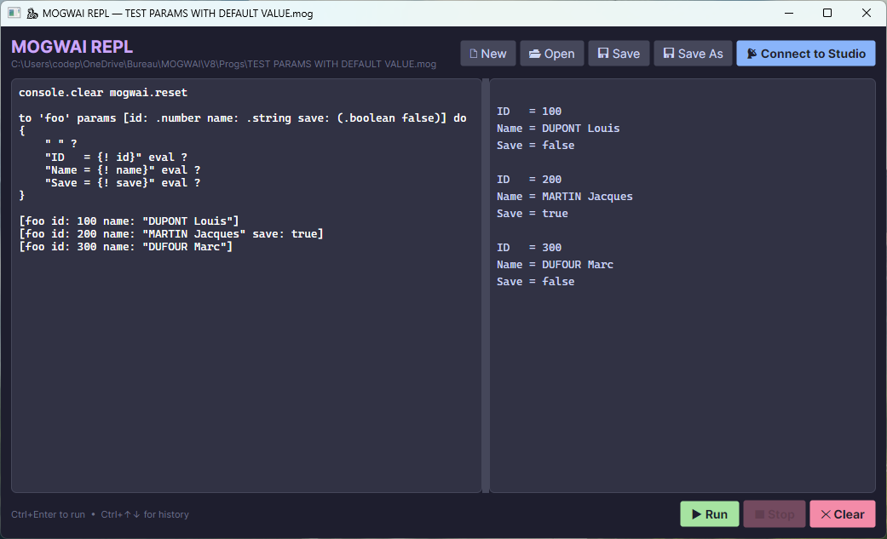

# [MOGWAI](https://www.mogwai.eu.com) - An embeddable RPN scripting engine for .NET


[](https://github.com/Sydney680928/mogwai/actions/workflows/ci.yml)
[](LICENSE)
[](https://dotnet.microsoft.com/)
[](https://www.nuget.org/packages/MOGWAI/)
[](https://www.nuget.org/packages/MOGWAI/)
[](https://marketplace.visualstudio.com/items?itemName=mogwai.mogwai-language)

**Embeddable. Extensible. NativeAOT-friendly.** A small stack-based RPN runtime you can drop into any .NET app — desktop, mobile, or IoT.

**▶ Try it now — [run MOGWAI in your browser](https://sydney680928.github.io/MOGWAI/)** — no install, no signup, runs entirely client-side.

> If MOGWAI looks useful to you, a ⭐ helps others discover it — thank you!

---

## What is MOGWAI?

MOGWAI is a lightweight scripting engine you embed in your .NET applications — to script complex workflows, expose safe user-customizable logic, or design your own DSL, all without leaving the .NET runtime (NativeAOT included). Under the hood it's a stack-based, concatenative language in the tradition of the legendary HP calculators (HP 28S, HP 48) — which gives it clean, unambiguous semantics with no operator precedence to reason about.

### The stack, in 30 seconds

MOGWAI reads left to right. Values are pushed onto a stack; operators consume values from it and push the result back. There's no operator precedence and no parentheses — the order on the stack *is* the program.

```
3            →  [ 3 ]
4            →  [ 3 4 ]
+            →  [ 7 ]
2            →  [ 7 2 ]
*            →  [ 14 ]
```

The same calculation on a single line — `3 4 + 2 *` — also leaves `[ 14 ]` on the stack. That's the whole idea: small pieces compose, and what you see is exactly what happens.

### Not ready for RPN yet? Use `calc`

New to stack-based thinking? You don't have to convert every formula by hand. The `calc` primitive accepts a regular infix expression as a string — parentheses, operator precedence and all — converts it to RPN under the hood (Dijkstra's Shunting-yard algorithm), and runs it immediately.

```
"5 * X + (7 + sin(Y))" calc
```

Write formulas the way you already know them, and grow into RPN at your own pace.

### Key Features

- **Stack-Based RPN Syntax** - Clean, unambiguous, no operator precedence
- **Infix Expressions via `calc`** - Write classic math formulas (`"5 * X + 2"`), auto-converted to RPN via Shunting-yard
- **304 Built-in Functions** - Math, strings, lists, files, HTTP, and more
- **Async/Await Support** - Modern asynchronous execution
- **Plugin System** - Clean plugin contract via `MOGWAI.IPlugin` — official plugins in development
- **Battle-Tested** - 10+ years of real-world usage
- **Extensible** - Easy integration with .NET applications
- **NativeAOT-Ready** - Embed in ahead-of-time compiled .NET apps
- **Cross-Platform** - Windows, Linux, macOS, Android, iOS
- **VS Code Extension** - Syntax highlighting, autocompletion, run & debug directly from VS Code ([install](https://marketplace.visualstudio.com/items?itemName=mogwai.mogwai-language))

---

## Get Started in Seconds

### Download a prebuilt CLI

The quickest way to try MOGWAI — no .NET SDK required. Grab a ready-to-run CLI for your platform from the [**Releases page**](https://github.com/Sydney680928/mogwai/releases). Each release ships self-contained binaries for Windows (x64), Linux (x64 / arm64) and macOS (x64 / arm64): download the archive, extract it, and run the `MOGWAI_CLI` executable.

> **First run on Windows or macOS.** The binaries are not code-signed, so the system will warn about an “unrecognized” app the first time — this is expected, not a problem with the build:
> - **Windows (SmartScreen):** click **More info** → **Run anyway**, or right-click the downloaded file → **Properties** → **Unblock** before extracting.
> - **macOS (Gatekeeper):** right-click the binary → **Open** → confirm, or run `xattr -d com.apple.quarantine MOGWAI_CLI` in Terminal.

### Build MOGWAI CLI from source

Clone the repository and build the CLI for your platform using the .NET SDK:

```bash
git clone https://github.com/Sydney680928/mogwai.git
cd mogwai/examples/Console/ConsoleExample
dotnet run
```

Or publish a self-contained binary:

```bash
# Windows x64
dotnet publish -c Release -r win-x64 --self-contained

# macOS x64
dotnet publish -c Release -r osx-x64 --self-contained

# macOS arm64
dotnet publish -c Release -r osx-arm64 --self-contained

# Linux x64
dotnet publish -c Release -r linux-x64 --self-contained

# Linux arm64
dotnet publish -c Release -r linux-arm64 --self-contained
```

### VS Code Extension

Write, run, and debug MOGWAI scripts directly from **Visual Studio Code** with full language support:

- **Syntax highlighting** — static keywords + dynamic primitives from the connected runtime
- **Autocompletion** — all runtime primitives, color-coded by category
- **Run & Debug** — execute scripts and step through code without leaving VS Code
- **Runtime panel** — live view of the stack, local and global variables
- **Error navigation** — jump directly to the failing instruction

[**Install MOGWAI Language Support**](https://marketplace.visualstudio.com/items?itemName=mogwai.mogwai-language) from the VS Code Marketplace

> **How to connect VS Code to the runtime:** see [MOGWAI_VSCODE.md](docs/EN/MOGWAI_VSCODE.md) for the step-by-step connection guide.

---

## The MOGWAI Ecosystem

### MOGWAI Runtime (Open Source)

The core scripting engine, available as a NuGet package. Embed MOGWAI in your .NET applications.

- **License:** Apache 2.0
- **Package:** [MOGWAI on NuGet](https://www.nuget.org/packages/MOGWAI/)
- **Status:** Production ready

> **API stability.** MOGWAI follows Semantic Versioning. The scripting language surface — syntax, primitives, and `MW.x` error codes — aims to remain stable within the 8.x line: scripts written today keep working. The C# embedding API is still maturing and may see occasional breaking changes, always documented in the [CHANGELOG](CHANGELOG.md) (for example, the error-identifier renames in 8.9.1).

### MOGWAI CLI (Open Source)

Command-line interface for running MOGWAI scripts and interactive REPL sessions.

- **License:** Apache 2.0
- **Repository:** [MOGWAI CLI](https://github.com/Sydney680928/mogwai/tree/main/examples/Console/ConsoleExample)
- **Status:** Functional

**Build from source** — requires the .NET SDK:

```bash
git clone https://github.com/Sydney680928/mogwai.git
cd mogwai/examples/Console/ConsoleExample
dotnet run
```

### MOGWAI VS Code Extension

Syntax highlighting, autocompletion, runtime execution, step-by-step debugging, and live variable inspection — all directly inside VS Code.

- **License:** Proprietary (free to use)
- **Marketplace:** [mogwai.mogwai-language](https://marketplace.visualstudio.com/items?itemName=mogwai.mogwai-language)
- **Documentation:** [MOGWAI_VSCODE.md](docs/EN/MOGWAI_VSCODE.md)
- **Status:** Available — v1.0.3

### MOGWAI STUDIO (in development)

MOGWAI STUDIO v2 — a cross-platform visual IDE for MOGWAI 8 (debugging, breakpoints, stack inspection, code editing) — is in early private development. More details will follow on [mogwai.eu.com](https://www.mogwai.eu.com).

- **License:** Proprietary (freemium)
- **Status:** Early private development — not yet publicly available

---

## Built with MOGWAI

Open source projects powered by the MOGWAI scripting engine:

| Project | Description |
|---|---|
| [**GIZMO**](https://gizmo.mogwai.eu.com) | Build Terminal User Interface (TUI) applications with MOGWAI scripting — cross-platform, self-contained, Apache 2.0 |

---

## Blog Articles

New to MOGWAI? **Start with these three:**

- [MOGWAI — The Origin Story](https://coding4phone.com/?p=2066&lang=en) — why MOGWAI exists and where it came from
- [Anatomy of MOGWAI](https://coding4phone.com/?p=2615&lang=en) — the fundamentals of its concatenative design
- [Embedding a scripting engine in a .NET MAUI app](https://coding4phone.com/?p=2461&lang=en) — the embedding value prop, end to end

<details>
<summary>All articles on coding4phone.com</summary>

- [MOGWAI in Production: How a Scripting Language Powers an Industrial Test Bench](https://coding4phone.com/?p=1990&lang=en)
- [MOGWAI Under the Hood: Syntactic Sugar and the RPN Canonical Form](https://coding4phone.com/?p=2003&lang=en)
- [MOGWAI — The `-->` Operator: Transforming a Variable In Place, Cleanly](https://coding4phone.com/?p=2010&lang=en)
- [Dynamic Variable Assignment in MOGWAI](https://coding4phone.com/?p=2026&lang=en)
- [Loops in MOGWAI](https://coding4phone.com/?p=2041&lang=en)
- [Timers in MOGWAI](https://coding4phone.com/?p=2060&lang=en)
- [MOGWAI — The Origin Story](https://coding4phone.com/?p=2066&lang=en)
- [Events in MOGWAI](https://coding4phone.com/?p=2080&lang=en)
- [Tasks in MOGWAI](https://coding4phone.com/?p=2194&lang=en)
- [Code editor in MOGWAI CLI](https://coding4phone.com/?p=2301&lang=en)
- [Bytes aren't scary. Manipulating binary data with MOGWAI](https://coding4phone.com/?p=2251&lang=en)
- [MOGWAI v8.6 — Objects and Assertions](https://coding4phone.com/?p=2324&lang=en)
- [One Day, One Extension — The Story of MOGWAI Language Support for VS Code](https://coding4phone.com/?p=2426&lang=en)
- [Embedding a scripting engine in a .NET MAUI app — dynamic logic, BLE commands, zero app updates](https://coding4phone.com/?p=2461&lang=en)
- [GIZMO — Build TUI Applications with MOGWAI](https://coding4phone.com/?p=2479&lang=en)
- [Evaluating a user-defined mathematical formula with GIZMO and MOGWAI](https://coding4phone.com/?p=2518&lang=en)
- [MOGWAI 8.7: sorted identifiers, OOP introspection, and external processes](https://coding4phone.com/?p=2545&lang=en)
- [MOGWAI meets Avalonia — A cross-platform REPL in a single session](https://coding4phone.com/?p=2561&lang=en)
- [MOGWAI Language Support for VS Code — v1.0.3](https://coding4phone.com/?p=2597&lang=en)
- [Anatomy of MOGWAI — the fundamental properties of a modern concatenative language](https://coding4phone.com/?p=2615&lang=en)

</details>

---

## Quick Start

### Installation

Install the MOGWAI runtime via NuGet:

```bash
dotnet add package MOGWAI
```

### Hello World

```csharp
using MOGWAI.Engine;
using MOGWAI.Interfaces;

var engine = new MogwaiEngine("MyApp");
engine.Delegate = this; // Your class implementing IDelegate

var result = await engine.RunAsync(@"
    ""Hello from MOGWAI!"" ?
    2 3 + ?
", debugMode: false);
```


### MOGWAI Language Example

```mogwai
# 1 — Print to output with ?
"Hello from MOGWAI!" ?      # → Hello from MOGWAI!
2 3 + ?                     # → 5
```

```mogwai
# 2 — Store and recall  ( value -> 'name' )
42 -> '$answer'             # the $ prefix marks a global variable
$answer ?                   # → 42
```

```mogwai
# 3 — Define and use a function
to 'square' with [n: .number] do
{
    n n *
}

5 square ?                  # → 25
```

```mogwai
# 4 — Transform a list
(1 2 3 4 5) foreach 'n' transform { n square } -> '$result'
$result ?                   # → (1 4 9 16 25)
```

```mogwai
# 5 — Structured data with records  (space-delimited — no commas)
[name: "MOGWAI" version: "8.9.1"] -> 'info'
info ?                      # → [name: "MOGWAI" version: "8.9.1"]
```

```mogwai
# 6 — Conditionals
if ($answer 40 >) then
{
    "The answer is greater than 40" ?
}
```

> **Note on variables:** Variables prefixed with `$` are **global**. When the engine is instantiated with `keepAlive: true`, global variables persist across multiple script executions — making them the natural choice for interactive sessions like the REPL or the [Blazor playground](https://sydney680928.github.io/MOGWAI/). Local variables (without `$`) are scoped to a single execution and are the recommended approach for one-shot embedding scenarios.
> ```csharp
> // Global variables persist across executions
> var engine = new MogwaiEngine("MyApp", keepAlive: true, useDefaultFolders: false);
>
> // Global variables are reset on each execution (default)
> var engine = new MogwaiEngine("MyApp");
> ```

---

## Is MOGWAI a Good Fit for You?

MOGWAI is a focused tool, not a general-purpose language. It shines when:

- You want **zero operator precedence ambiguity** — the stack is the single source of truth
- You're embedding a scripting runtime in a **.NET** application, including **NativeAOT** builds
- You appreciate the **concatenative programming** model in the tradition of Forth, Factor, PostScript and HP RPL
- You need a **lightweight, extensible runtime** with a clean plugin contract
- You want to offer safe, hot-swappable scripting to your users — update logic without recompiling or redeploying your app

---

## Build from Source

### Prerequisites

- [.NET SDK 9.0](https://dotnet.microsoft.com/download) or later
- Git

### Clone and Build

```bash
# Clone repository
git clone https://github.com/Sydney680928/mogwai.git
cd mogwai

# Restore dependencies
dotnet restore src/MOGWAI/MOGWAI.sln

# Build
dotnet build src/MOGWAI/MOGWAI.sln --configuration Release

# Pack (optional)
dotnet pack src/MOGWAI/MOGWAI.sln --configuration Release
```

The compiled assembly will be in `src/MOGWAI/MOGWAI/bin/Release/net9.0/`.

### Project Structure

```
mogwai/
├── .github/
│   └── workflows/                  # GitHub Actions (CI, GitHub Pages deployment)
├── docs/
│   ├── EN/
│   │   ├── use-cases/              # Use case articles
│   │   ├── MOGWAI_EN.md            # Language reference
│   │   ├── MOGWAI_FUNCTIONS_EN.md  # Function reference
│   │   └── MOGWAI_INTEGRATION_GUIDE_EN.md  # Integration guide
│   └── FR/
│       ├── cas d'usage/            # Use case articles in french
│       ├── MOGWAI_FR.md            # Language reference in french
│       ├── MOGWAI_FUNCTIONS_FR.md  # Function reference in french
│       └── MOGWAI_INTEGRATION_GUIDE_FR.md  # Integration guide in french
├── examples/
│   ├── Avalonia/
│   │   └── MogwaiRepl/             # Cross-platform REPL with Avalonia UI
│   ├── Blazor/
│   │   └── MogwaiPlayground/       # Blazor WASM interactive playground
│   ├── Console/
│   │   └── ConsoleExample/
│   │       └── MOGWAI_CLI/         # Command-line interface and REPL
│   ├── MAUI/
│   │   └── MauiExample/            # Cross-platform mobile app
│   └── WinForms/
│       └── WinFormsExample/        # Turtle graphics demo
├── images/                         # Screenshots and media
├── src/
│   └── MOGWAI/
│       ├── MOGWAI.sln              # Main solution
│       ├── MOGWAI/
│       │   ├── Engine/             # Core runtime engine
│       │   ├── Objects/            # MOGWAI object types
│       │   ├── Primitives/         # Built-in functions (304 primitives)
│       │   ├── Interfaces/         # Public interfaces (IDelegate, IPlugin)
│       │   └── Exceptions/         # Exception types
│       ├── MOGWAI.Tests/           # Unit tests
│       └── MOGWAI_TEST/            # Lightweight CLI runner for in-solution testing
├── LICENSE                         # Apache 2.0 license
├── NOTICE                          # Copyright notice
└── README.md                       # This file
```

---

## Documentation

### Complete Guides

- **[Language Reference](https://github.com/Sydney680928/mogwai/tree/main/docs/EN/MOGWAI_EN.md)** - Complete MOGWAI language guide
- **[Function Reference](https://github.com/Sydney680928/mogwai/tree/main/docs/EN/MOGWAI_FUNCTIONS_EN.md)** - All 304 built-in functions
- **[Integration Guide](https://github.com/Sydney680928/mogwai/tree/main/docs/EN/MOGWAI_INTEGRATION_GUIDE_EN.md)** - How to integrate MOGWAI in your .NET apps
- **[VS Code Extension Guide](https://github.com/Sydney680928/mogwai/tree/main/docs/EN/MOGWAI_VSCODE.md)** - How to use VS Code with the MOGWAI runtime

### Examples

Examples are available:

- **[MOGWAI CLI](https://github.com/Sydney680928/mogwai/tree/main/examples/Console)** - Command-line interface and REPL
- **[Avalonia Example](https://github.com/Sydney680928/mogwai/tree/main/examples/Avalonia)** - Cross-platform REPL with Studio mode (Windows, Linux, macOS)
- **[WinForms Example](https://github.com/Sydney680928/mogwai/tree/main/examples/WinForms)** - Turtle graphics with MOGWAI
- **[MAUI Example](https://github.com/Sydney680928/mogwai/tree/main/examples/MAUI)** - Cross-platform mobile app
- **[Blazor Example](https://github.com/Sydney680928/mogwai/tree/main/examples/Blazor)** - Blazor WASM app

### Changelog

See [CHANGELOG.md](CHANGELOG.md) for a detailed history of changes.

**Latest Release:** [v8.9.1](https://github.com/Sydney680928/mogwai/releases/tag/v8.9.1)

---

## Use Cases

### Blazor WASM Applications


You can test it live on [Blazor REPL](https://sydney680928.github.io/MOGWAI/)

### Avalonia Cross-Platform REPL



A full-featured REPL and script editor running natively on Windows, Linux and macOS — with Studio mode for live VS Code debugging.

[**Avalonia REPL Example →**](https://github.com/Sydney680928/mogwai/tree/main/examples/Avalonia/MogwaiRepl)

### Embedded Applications

```mogwai
# WinForms turtle graphics
100 turtle.forward
90 turtle.right
100 turtle.forward
"Square complete!" ?
```


### Industrial IoT Automation

*Illustrative example* — how MOGWAI orchestrates hardware through plugins:

```mogwai
# Read sensor via BLE (requires MOGWAI_BLE plugin — coming soon)
"AA:BB:CC:DD:EE:FF" ble.connect -> 'device'
device "temperature" ble.read -> 'temp'

# Control based on value
if (temp 25 >) then
{
    "fan" gpio.on
}
```

> *Note: Official MOGWAI plugins (BLE, Serial...) are currently in development and not yet publicly available. Third-party plugins can already be built today by implementing the `MOGWAI.IPlugin` interface.*


[Use Case #1 — Electronic Board Test Bench](docs/EN/use-cases/use-case-01-test-bench.md)

---

## Roadmap

### Version 8.0 (Released)

- Complete rewrite with namespace organization
- 240+ primitives
- Apache 2.0 open source license
- Published on NuGet
- .NET 9.0 support
- Complete documentation

### Version 8.4

- Plugin contract via `MOGWAI.IPlugin` interface
- AOT compatibility (`IsAotCompatible`)
- Major performance optimizations (O(1) primitive lookup, LINQ removal in hot paths)
- `bag` primitive
- `!A` auto-eval sigil
- `-->` in-place pipeline operator
- Binary data primitives (DATA/BIN families)

### Version 8.5

- Enhanced debugging protocol
- 280+ built-in primitives
- Additional examples and documentation

### Version 8.6

- OOP support (classes, instances, properties, methods, lifecycle hooks)
- MOGWAI STUDIO v2 (early private development — rebuilt from scratch for MOGWAI 8)

### Version 8.7

- Sorted identifiers
- OOP introspection
- External processes support

### Version 8.8

- Skill system — scripts can verify at startup that they run in the right host environment (`skills`, `hasSkill`, `mogwai.assertSkill`)
- `IDelegate` default implementations — MOGWAI is now embeddable with zero delegate code for simple use cases
- `console.width` / `console.height` primitives
- `post` primitive — deferred block execution after pending events and timers
- `path.home` / `path.setHome` primitives and `HomeDirectory` property on `MogwaiEngine`
- `mogwai.info` now includes a `skills:` key

### Version 8.9.1 (Latest)

- `task.start` primitive — launch a parameterless task cleanly, without passing and discarding a dummy value
- Corrected public error identifiers (host-side naming fixes; scripts are unaffected, they identify errors by `MW.x` code)
- Auto-evaluation `!` flag now cleared after evaluation of records and lists — avoids needless re-evaluation on every access
- Corrected English wording in several built-in error messages

### Future Plans

- MOGWAI STUDIO v2 public release
- Community plugins marketplace
- Additional language integrations
- Extended function library

---

## Contributing

Contributions are welcome! Here's how you can help:

### Reporting Issues

Found a bug or have a feature request? Please open an issue on GitHub:

- **Bug Reports:** Use the bug report template
- **Feature Requests:** Describe the use case and expected behavior
- **Questions:** Use GitHub Discussions

### Contributing Code

1. Fork the repository
2. Create a feature branch (`git checkout -b feature/amazing-feature`)
3. Make your changes
4. Commit with clear messages (`git commit -m 'Add amazing feature'`)
5. Push to your fork (`git push origin feature/amazing-feature`)
6. Open a Pull Request

### Code Style

- Follow existing code conventions
- Add XML documentation comments for public APIs
- Keep functions focused and well-named

---

## Why MOGWAI?

### Born from Real Needs

Created in 2015 to simulate Bluetooth Low Energy devices for IoT testing. Over 10 years, MOGWAI evolved into a full-featured scripting language used in industrial automation.

### Battle-Tested

- **10+ years of real-world usage** - From prototyping to industrial environments
- **A documented case** - See how MOGWAI scripts drive an [electronic board test bench in production](docs/EN/use-cases/use-case-01-test-bench.md) ([read the story](https://coding4phone.com/?p=1990&lang=en))

### HP Calculator Heritage

Inspired by the legendary HP 28S and HP 48 calculators, MOGWAI brings RPN elegance to modern software:

- **Clear semantics** - No operator precedence confusion
- **Stack-based** - Natural for complex calculations
- **Composable** - Build complex operations from simple parts

---

## License

### MOGWAI Runtime & CLI

**Apache License 2.0**

```
Copyright 2015-2026 Stéphane Sibué

Licensed under the Apache License, Version 2.0 (the "License");
you may not use this file except in compliance with the License.
You may obtain a copy of the License at

    http://www.apache.org/licenses/LICENSE-2.0

Unless required by applicable law or agreed to in writing, software
distributed under the License is distributed on an "AS IS" BASIS,
WITHOUT WARRANTIES OR CONDITIONS OF ANY KIND, either express or implied.
See the License for the specific language governing permissions and
limitations under the License.
```

See [LICENSE](LICENSE) and [NOTICE](NOTICE) for details.

### MOGWAI STUDIO

**Proprietary License** - Freemium model (Free + Pro versions)

MOGWAI STUDIO is not open source and will be distributed under a proprietary license. More details will be announced upon release.

---

## Links

- **Website:** [mogwai.eu.com](https://www.mogwai.eu.com)
- **NuGet Package:** [MOGWAI](https://www.nuget.org/packages/MOGWAI/)
- **Author:** [Stéphane Sibué](https://www.coding4phone.com)
- **GitHub:** [Sydney680928/mogwai](https://github.com/Sydney680928/mogwai)
- **Issues:** [Report a bug](https://github.com/Sydney680928/mogwai/issues)

---

## Community & Support

- **GitHub Issues:** For bug reports and feature requests
- **GitHub Discussions:** For questions and community support
- **Email:** Contact via [coding4phone.com](https://www.coding4phone.com)

---

## Acknowledgments

- **HP Calculators** - For inspiring the RPN approach
- **Open Source Community** - For .NET and supporting tools
- **Early Adopters** - For feedback and real-world testing

---

## Have Questions or Feedback?

We'd love to hear from you!

- **Found a bug?** [Open an issue](https://github.com/Sydney680928/mogwai/issues/new)
- **Have an idea?** [Start a discussion](https://github.com/Sydney680928/mogwai/discussions/new)
- **Like MOGWAI?** Star the repo to show your support!
- **Using MOGWAI in production?** We'd love to hear your story!

Even a simple "I tried it and it works!" is valuable feedback!

---

**Made with ❤️ by [Stéphane Sibué](https://www.coding4phone.com)**

*MOGWAI - Where stack-based elegance meets modern .NET power* ✨
