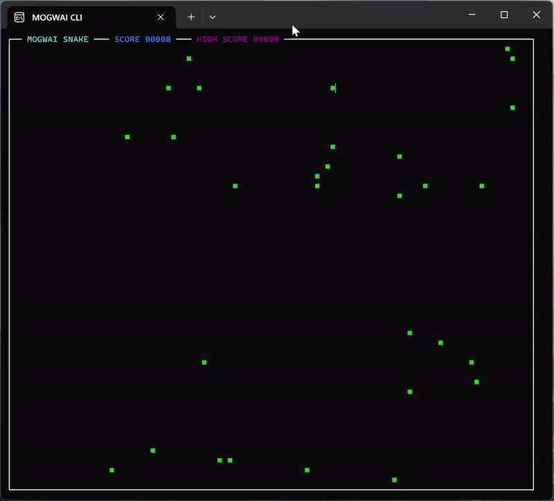

# [MOGWAI](https://www.mogwai.eu.com) - Embeddable Scripting for .NET


[](https://github.com/Sydney680928/mogwai/actions/workflows/ci.yml)
[](LICENSE)
[](https://dotnet.microsoft.com/)
[](https://www.nuget.org/packages/MOGWAI/)
[](https://www.nuget.org/packages/MOGWAI/)
[](https://marketplace.visualstudio.com/items?itemName=mogwai.mogwai-language)

**Give your .NET app a scripting engine in 4 lines of code.** Embeddable, extensible, NativeAOT-friendly — small enough to drop into desktop, mobile, or IoT apps, to script workflows or expose safe, hot-swappable logic to your users.

**▶ Try it now — [run MOGWAI in your browser](https://sydney680928.github.io/MOGWAI/)** — no install, no signup, runs entirely client-side.

> If MOGWAI looks useful to you, a ⭐ helps others discover it — thank you!

---

## What is MOGWAI?

MOGWAI is a lightweight scripting engine you embed in your .NET applications — to script complex workflows, expose safe user-customizable logic, or design your own DSL, all without leaving the .NET runtime (NativeAOT included).

### Looks familiar? It should.

```mogwai
foo(45 "TOTO" 17)       # classic-style call — reads like foo(45, "TOTO", 17)
foo[x: 10 y: 20]        # named parameters, C#-style
45 "TOTO" 17 foo        # the exact same call, written in MOGWAI's native RPN form
```

Under the hood, MOGWAI is a stack-based, concatenative engine — which is what gives it clean, unambiguous semantics with no operator precedence to reason about. But day to day, you can write and read code in the classic-style syntax above; the stack form is always there when you want it (better performance, more composable), never a requirement.

### The stack, in 30 seconds

*For the curious — here's what's actually happening under the hood.*

MOGWAI reads left to right. Values are pushed onto a stack; operators consume values from it and push the result back. There's no operator precedence and no parentheses — the order on the stack *is* the program.

```
3            →  [ 3 ]
4            →  [ 3 4 ]
+            →  [ 7 ]
2            →  [ 7 2 ]
*            →  [ 14 ]
```

The same calculation on a single line — `3 4 + 2 *` — also leaves `[ 14 ]` on the stack. That's the whole idea: small pieces compose, and what you see is exactly what happens.

### Not ready for RPN yet? Use `calc`

New to stack-based thinking? You don't have to convert every formula by hand. The `calc` primitive accepts a regular infix expression as a string — parentheses, operator precedence and all — converts it to RPN under the hood (Dijkstra's Shunting-yard algorithm), and runs it immediately.

```
"5 * X + (7 + sin(Y))" calc
```

Write formulas the way you already know them, and grow into RPN at your own pace.

### Key Features

- **Classic-Style Syntax** - Write `foo(45 "TOTO" 17)` or `foo[x: 10 y: 20]` — reads like C#/Java, no RPN required to get started
- **354 Built-in Functions** - Math, strings, lists, files, HTTP, and more
- **Async/Await Support** - Modern asynchronous execution
- **Plugin System** - Clean plugin contract via `MOGWAI.IPlugin` — official plugins in development
- **Battle-Tested** - 10+ years of real-world usage
- **Extensible** - Easy integration with .NET applications
- **NativeAOT-Ready** - Embed in ahead-of-time compiled .NET apps
- **Cross-Platform** - Windows, Linux, macOS, Android, iOS
- **VS Code Extension** - Syntax highlighting, autocompletion, run & debug directly from VS Code ([install](https://marketplace.visualstudio.com/items?itemName=mogwai.mogwai-language))
- **Stack-Based RPN Core** - Clean, unambiguous engine underneath, with `calc` for classic infix math formulas when you want them (`"5 * X + 2"`, via Shunting-yard)

---

## Get Started in Seconds

### Download a prebuilt CLI

The quickest way to try MOGWAI — no .NET SDK required. Grab a ready-to-run CLI for your platform from the [**Releases page**](https://github.com/Sydney680928/mogwai/releases). Each release ships self-contained binaries for Windows (x64), Linux (x64 / arm64) and macOS (x64 / arm64): download the archive, extract it, and run the `MOGWAI_CLI` executable.

> **First run on Windows or macOS.** The binaries are not code-signed, so the system will warn about an “unrecognized” app the first time — this is expected, not a problem with the build:
> - **Windows (SmartScreen):** click **More info** → **Run anyway**, or right-click the downloaded file → **Properties** → **Unblock** before extracting.
> - **macOS (Gatekeeper):** right-click the binary → **Open** → confirm, or run `xattr -d com.apple.quarantine MOGWAI_CLI` in Terminal.

### Build MOGWAI CLI from source

Clone the repository and build the CLI for your platform using the .NET SDK:

```bash
git clone https://github.com/Sydney680928/mogwai.git
cd mogwai/examples/Console/ConsoleExample/MOGWAI_CLI
dotnet run
```

Or publish a self-contained binary:

```bash
# Windows x64
dotnet publish -c Release -r win-x64 --self-contained

# macOS x64
dotnet publish -c Release -r osx-x64 --self-contained

# macOS arm64
dotnet publish -c Release -r osx-arm64 --self-contained

# Linux x64
dotnet publish -c Release -r linux-x64 --self-contained

# Linux arm64
dotnet publish -c Release -r linux-arm64 --self-contained
```

### VS Code Extension

Write, run, and debug MOGWAI scripts directly from **Visual Studio Code** with full language support:

- **Syntax highlighting** — static keywords + dynamic primitives from the connected runtime
- **Autocompletion** — all runtime primitives, color-coded by category
- **Run & Debug** — execute scripts and step through code without leaving VS Code
- **Runtime panel** — live view of the stack, local and global variables
- **Error navigation** — jump directly to the failing instruction

[**Install MOGWAI Language Support**](https://marketplace.visualstudio.com/items?itemName=mogwai.mogwai-language) from the VS Code Marketplace

> **How to connect VS Code to the runtime:** see [MOGWAI_VSCODE.md](docs/EN/MOGWAI_VSCODE.md) for the step-by-step connection guide.

---

## The MOGWAI Ecosystem

### MOGWAI Runtime (Open Source)

The core scripting engine, available as a NuGet package. Embed MOGWAI in your .NET applications.

- **License:** Apache 2.0
- **Package:** [MOGWAI on NuGet](https://www.nuget.org/packages/MOGWAI/)
- **Status:** Production ready

> **API stability.** MOGWAI follows Semantic Versioning. Scripts written today keep working — the language surface (syntax, primitives, `MW.x` error codes) stays stable within the 8.x line. The C# embedding API is still maturing; occasional breaking changes there are documented in the [CHANGELOG](CHANGELOG.md).

### MOGWAI CLI (Open Source)

Command-line interface for running MOGWAI scripts and interactive REPL sessions.

- **License:** Apache 2.0
- **Source:** built from the [`examples/Console`](https://github.com/Sydney680928/mogwai/tree/main/examples/Console/ConsoleExample/MOGWAI_CLI) example, in this same repository
- **Status:** Functional

**Build from source** — requires the .NET SDK:

```bash
git clone https://github.com/Sydney680928/mogwai.git
cd mogwai/examples/Console/ConsoleExample/MOGWAI_CLI
dotnet run
```

### MOGWAI VS Code Extension

Syntax highlighting, autocompletion, runtime execution, step-by-step debugging, and live variable inspection — all directly inside VS Code.

- **License:** Apache 2.0
- **Repository:** [Sydney680928/mogwai-vscode](https://github.com/Sydney680928/mogwai-vscode)
- **Marketplace:** [mogwai.mogwai-language](https://marketplace.visualstudio.com/items?itemName=mogwai.mogwai-language)
- **Documentation:** [MOGWAI_VSCODE.md](docs/EN/MOGWAI_VSCODE.md)
- **Status:** Available — v1.3.4

### MOGWAI STUDIO

A visual IDE for MOGWAI 8 (debugging, breakpoints, stack inspection, code editing), currently built with WinForms (Windows only). Details will follow on [mogwai.eu.com](https://www.mogwai.eu.com) when available.

- **License:** Proprietary (freemium)

---

## Built with MOGWAI

Open source projects powered by the MOGWAI scripting engine:

| Project | Description |
|---|---|
| [**GIZMO**](https://gizmo.mogwai.eu.com) | Build Terminal User Interface (TUI) applications with MOGWAI scripting — cross-platform, self-contained, Apache 2.0 |

---

## Blog Articles

New to MOGWAI? **Start with these three:**

- [MOGWAI — The Origin Story](https://coding4phone.com/?p=2066&lang=en) — why MOGWAI exists and where it came from
- [Anatomy of MOGWAI](https://coding4phone.com/?p=2615&lang=en) — the fundamentals of its concatenative design
- [Embedding a scripting engine in a .NET MAUI app](https://coding4phone.com/?p=2461&lang=en) — the embedding value prop, end to end
- [MOGWAI Snake — A Complete Game Written in RPN Scripting Language](https://coding4phone.com/?p=2662&lang=en) - a snake game with MOGWAI, it's possible !

<details>
<summary>All articles on coding4phone.com</summary>

- [MOGWAI in Production: How a Scripting Language Powers an Industrial Test Bench](https://coding4phone.com/?p=1990&lang=en)
- [MOGWAI Under the Hood: Syntactic Sugar and the RPN Canonical Form](https://coding4phone.com/?p=2003&lang=en)
- [MOGWAI — The `-->` Operator: Transforming a Variable In Place, Cleanly](https://coding4phone.com/?p=2010&lang=en)
- [Dynamic Variable Assignment in MOGWAI](https://coding4phone.com/?p=2026&lang=en)
- [Loops in MOGWAI](https://coding4phone.com/?p=2041&lang=en)
- [Timers in MOGWAI](https://coding4phone.com/?p=2060&lang=en)
- [MOGWAI — The Origin Story](https://coding4phone.com/?p=2066&lang=en)
- [Events in MOGWAI](https://coding4phone.com/?p=2080&lang=en)
- [Tasks in MOGWAI](https://coding4phone.com/?p=2194&lang=en)
- [Code editor in MOGWAI CLI](https://coding4phone.com/?p=2301&lang=en)
- [Bytes aren't scary. Manipulating binary data with MOGWAI](https://coding4phone.com/?p=2251&lang=en)
- [MOGWAI v8.6 — Objects and Assertions](https://coding4phone.com/?p=2324&lang=en)
- [One Day, One Extension — The Story of MOGWAI Language Support for VS Code](https://coding4phone.com/?p=2426&lang=en)
- [Embedding a scripting engine in a .NET MAUI app — dynamic logic, BLE commands, zero app updates](https://coding4phone.com/?p=2461&lang=en)
- [GIZMO — Build TUI Applications with MOGWAI](https://coding4phone.com/?p=2479&lang=en)
- [Evaluating a user-defined mathematical formula with GIZMO and MOGWAI](https://coding4phone.com/?p=2518&lang=en)
- [MOGWAI 8.7: sorted identifiers, OOP introspection, and external processes](https://coding4phone.com/?p=2545&lang=en)
- [MOGWAI meets Avalonia — A cross-platform REPL in a single session](https://coding4phone.com/?p=2561&lang=en)
- [MOGWAI Language Support for VS Code — v1.0.3](https://coding4phone.com/?p=2597&lang=en)
- [Anatomy of MOGWAI — the fundamental properties of a modern concatenative language](https://coding4phone.com/?p=2615&lang=en)
- [Counting GitHub release downloads… in MOGWAI](https://coding4phone.com/?p=2703&lang=en)

</details>

---

## Quick Start

### Installation

Install the MOGWAI runtime via NuGet:

```bash
dotnet add package MOGWAI
```

### Hello World

```csharp
using MOGWAI.Engine;
using MOGWAI.Interfaces;

var engine = new MogwaiEngine("MyApp");
engine.Delegate = this; // Your class implementing IDelegate

var result = await engine.RunAsync(@"
    ""Hello from MOGWAI!"" ?
    2 3 + ?
", debugMode: false);
```


### MOGWAI Language Example

```mogwai
# 1 — Print to output with ?
"Hello from MOGWAI!" ?      # → Hello from MOGWAI!
2 3 + ?                     # → 5
```

```mogwai
# 2 — Store and recall  ( value -> 'name' )
42 -> '$answer'             # the $ prefix marks a global variable
$answer ?                   # → 42
```

```mogwai
# 3 — Define and use a function
to 'square' with [n: .number] do
{
    n n *
}

square(5) ?                  # → 25   (classic-style call)
5 square ?                   # → 25   (same call, native RPN form)
```

```mogwai
# 4 — Transform a list
(1 2 3 4 5) foreach 'n' transform { n square } -> '$result'
$result ?                   # → (1 4 9 16 25)
```

```mogwai
# 5 — Structured data with records  (space-delimited — no commas)
[name: "MOGWAI" version: "8.14.0"] -> 'info'
info ?                      # → [name: "MOGWAI" version: "8.14.0"]
```

```mogwai
# 6 — Conditionals
if ($answer 40 >) then
{
    "The answer is greater than 40" ?
}
```

> **Note on variables:** Variables prefixed with `$` are **global**. When the engine is instantiated with `keepAlive: true`, global variables persist across multiple script executions — making them the natural choice for interactive sessions like the REPL or the [Blazor playground](https://sydney680928.github.io/MOGWAI/). Local variables (without `$`) are scoped to a single execution and are the recommended approach for one-shot embedding scenarios.
> ```csharp
> // Global variables persist across executions
> var engine = new MogwaiEngine("MyApp", keepAlive: true);
>
> // Global variables are reset on each execution (default)
> var engine = new MogwaiEngine("MyApp");
> ```

---

## Is MOGWAI a Good Fit for You?

MOGWAI is a focused tool, not a general-purpose language. It shines when:

- You want **354 built-in functions** (math, strings, lists, files, HTTP, and more) without pulling in a heavier language runtime
- You're embedding a scripting runtime in a **.NET** application, including **NativeAOT** builds
- You need a **lightweight, extensible runtime** with a clean plugin contract
- You want to offer safe, hot-swappable scripting to your users — update logic without recompiling or redeploying your app
- You appreciate the **concatenative programming** model in the tradition of Forth, Factor, PostScript and HP RPL
- You want **zero operator precedence ambiguity** — the stack is the single source of truth

---

## Build from Source

### Prerequisites

- [.NET SDK 9.0](https://dotnet.microsoft.com/download) or later
- Git

### Clone and Build

```bash
# Clone repository
git clone https://github.com/Sydney680928/mogwai.git
cd mogwai

# Restore dependencies
dotnet restore src/MOGWAI/MOGWAI.sln

# Build
dotnet build src/MOGWAI/MOGWAI.sln --configuration Release

# Pack (optional)
dotnet pack src/MOGWAI/MOGWAI.sln --configuration Release
```

The compiled assembly will be in `src/MOGWAI/MOGWAI/bin/Release/net9.0/`.

### Project Structure

```
mogwai/
├── .github/
│   └── workflows/                  # GitHub Actions (CI, GitHub Pages deployment)
├── docs/
│   ├── EN/
│   │   ├── use-cases/              # Use case articles
│   │   ├── MOGWAI_EN.md            # Language reference
│   │   ├── MOGWAI_FUNCTIONS_EN.md  # Function reference
│   │   └── MOGWAI_INTEGRATION_GUIDE_EN.md  # Integration guide
│   └── FR/
│       ├── cas d'usage/            # Use case articles in french
│       ├── MOGWAI_FR.md            # Language reference in french
│       ├── MOGWAI_FUNCTIONS_FR.md  # Function reference in french
│       └── MOGWAI_INTEGRATION_GUIDE_FR.md  # Integration guide in french
├── examples/
│   ├── Avalonia/
│   │   └── MogwaiRepl/             # Cross-platform REPL with Avalonia UI
│   ├── Blazor/
│   │   └── MogwaiPlayground/       # Blazor WASM interactive playground
│   ├── Console/
│   │   └── ConsoleExample/
│   │       └── MOGWAI_CLI/         # Command-line interface and REPL
│   ├── MAUI/
│   │   └── MauiExample/            # Cross-platform mobile app
│   ├── Scripts/                    # Standalone .mog example scripts (games, tasks, web)
│   └── WinForms/
│       └── WinFormsExample/        # Turtle graphics demo
├── images/                         # Screenshots and media
├── src/
│   └── MOGWAI/
│       ├── MOGWAI.sln              # Main solution
│       ├── MOGWAI/
│       │   ├── Engine/             # Core runtime engine
│       │   ├── Objects/            # MOGWAI object types
│       │   ├── Primitives/         # Built-in functions (354 primitives)
│       │   ├── Interfaces/         # Public interfaces (IDelegate, IPlugin)
│       │   └── Exceptions/         # Exception types
│       ├── MOGWAI.Tests/           # Unit tests
│       └── MOGWAI_TEST/            # Lightweight CLI runner for in-solution testing
├── LICENSE                         # Apache 2.0 license
├── NOTICE                          # Copyright notice
├── CONTRIBUTING.md                 # Contribution guidelines
└── README.md                       # This file
```

---

## Documentation

### Complete Guides

- **[Language Reference](https://github.com/Sydney680928/mogwai/tree/main/docs/EN/MOGWAI_EN.md)** - Complete MOGWAI language guide
- **[Function Reference](https://github.com/Sydney680928/mogwai/tree/main/docs/EN/MOGWAI_FUNCTIONS_EN.md)** - All 354 built-in functions
- **[Integration Guide](https://github.com/Sydney680928/mogwai/tree/main/docs/EN/MOGWAI_INTEGRATION_GUIDE_EN.md)** - How to integrate MOGWAI in your .NET apps
- **[VS Code Extension Guide](https://github.com/Sydney680928/mogwai/tree/main/docs/EN/MOGWAI_VSCODE.md)** - How to use VS Code with the MOGWAI runtime

### Examples

Examples are available:

- **[MOGWAI CLI](https://github.com/Sydney680928/mogwai/tree/main/examples/Console)** - Command-line interface and REPL
- **[Avalonia Example](https://github.com/Sydney680928/mogwai/tree/main/examples/Avalonia)** - Cross-platform REPL with Studio mode (Windows, Linux, macOS)
- **[WinForms Example](https://github.com/Sydney680928/mogwai/tree/main/examples/WinForms)** - Turtle graphics with MOGWAI
- **[MAUI Example](https://github.com/Sydney680928/mogwai/tree/main/examples/MAUI)** - Cross-platform mobile app
- **[Blazor Example](https://github.com/Sydney680928/mogwai/tree/main/examples/Blazor)** - Blazor WASM app
- **[Scripts](https://github.com/Sydney680928/mogwai/tree/main/examples/Scripts)** - Standalone `.mog` scripts (games, task patterns, a GitHub API example)

  

### Changelog

See [CHANGELOG.md](CHANGELOG.md) for a detailed history of changes.

**Latest Release:** [v8.14.0](https://github.com/Sydney680928/mogwai/releases/tag/v8.14.0)

---

## Use Cases

### Blazor WASM Applications


You can test it live on [Blazor REPL](https://sydney680928.github.io/MOGWAI/)

### Avalonia Cross-Platform REPL


A full-featured REPL and script editor running natively on Windows, Linux and macOS — with Studio mode for live VS Code debugging.

[**Avalonia REPL Example →**](https://github.com/Sydney680928/mogwai/tree/main/examples/Avalonia/MogwaiRepl)

### Embedded Applications

```mogwai
# WinForms turtle graphics — classic-style
turtle.forward(100)
turtle.right(90)
turtle.forward(100)
"Square complete!" ?
```

```mogwai
# same script, native RPN form
100 turtle.forward
90 turtle.right
100 turtle.forward
"Square complete!" ?
```


### Industrial IoT Automation

*Illustrative example* — how MOGWAI orchestrates hardware through plugins:

```mogwai
# Read sensor via BLE (requires MOGWAI_BLE plugin — coming soon) — classic-style calls
ble.connect("AA:BB:CC:DD:EE:FF") -> 'device'
ble.read(device "temperature") -> 'temp'

# Control based on value — comparisons stay in RPN, they read best that way
if (temp 25 >) then
{
    gpio.on("fan")
}
```

> *Note: Official MOGWAI plugins (BLE, Serial...) are currently in development and not yet publicly available. Third-party plugins can already be built today by implementing the `MOGWAI.IPlugin` interface.*


[Use Case #1 — Electronic Board Test Bench](docs/EN/use-cases/use-case-01-test-bench.md)

---

## Roadmap

Full version history lives in [CHANGELOG.md](CHANGELOG.md). Highlights of the latest release, **v8.14.0**:

- Full HTTP verb coverage (`http.head/put/patch/delete`) and UDP primitives (`udp.send/receive/sendReceive`)
- Hardened HTTP internals (shared `HttpClient`, consistent error reporting)
- `sum` on an empty list `()` now returns `0` instead of raising an error

**Next up:** a community plugins marketplace, additional language integrations, and an extended function library.

<details>
<summary>Older milestones (8.0 → 8.6)</summary>

### Version 8.0

- Complete rewrite with namespace organization
- 240+ primitives
- Apache 2.0 open source license
- Published on NuGet
- .NET 9.0 support
- Complete documentation

### Version 8.1

- `+/-` primitive to negate a number
- New error code: `OperationNotSupportedError` (MW.7)
- Convenience typed-object helpers on `MOGBaseItems` (`AddString`, `AddNumber`, `AddBoolean`, …) and `MOGRecord` (`SetString`, `SetNumber`, `SetBoolean`, …) — no explicit `Engine` reference required
- `foreach ... transform` — transform items while iterating a list

### Version 8.2

- Classic-style call syntax as alternatives to RPN: `foo[x: 50 y: 20]` (named parameters) and `foo(2 3 4)` (parameter list)
- Parser now reports the source position on error (used by MOGWAI STUDIO)
- Fixed UI freezes and timer/event issues in the Blazor WebAssembly playground under long-running scripts

### Version 8.3

- Variable references with `&varname` — mutate variable content in place instead of pushing a copy (`+`, `set`, `get`, `butfirst`, `butlast`, `last`, `first`, `sub`, `size`)
- Explicit variable access with the `@` sigil — significant performance gain on frequent variable access
- `char->` primitive — ASCII code from a single character
- `foreach` loop over string characters
- Performance work: host function detection at parse time, faster dictionary lookups, removed systematic primitive cloning during execution

### Version 8.4

- Plugin contract via `MOGWAI.IPlugin` interface
- AOT compatibility (`IsAotCompatible`)
- Major performance optimizations (O(1) primitive lookup, LINQ removal in hot paths)
- `bag` primitive
- `!A` auto-eval sigil
- `-->` in-place pipeline operator
- Binary data primitives (DATA/BIN families)

### Version 8.5

- Enhanced debugging protocol
- 280+ built-in primitives
- Additional examples and documentation

### Version 8.6

- OOP support (classes, instances, properties, methods, lifecycle hooks)
- MOGWAI STUDIO v2 (early private development — rebuilt from scratch for MOGWAI 8)

*(8.7 through 8.14 — skill system, OOP introspection, math/string primitive families, `calc`, HTTP/UDP support — see [CHANGELOG.md](CHANGELOG.md) for full detail.)*

</details>

---

## Contributing

Contributions are welcome! Bug reports, feature requests, and pull requests all start the same way — see [CONTRIBUTING.md](CONTRIBUTING.md) for the full guide (issue templates, branch/PR workflow, code style).

---

## Why MOGWAI?

Created in 2015 to simulate Bluetooth Low Energy devices for IoT testing, MOGWAI evolved over 10+ years into a full-featured scripting language now used in industrial automation — see how it drives an [electronic board test bench in production](docs/EN/use-cases/use-case-01-test-bench.md) ([read the story](https://coding4phone.com/?p=1990&lang=en)).

> If you grew up on an HP 28S or HP 48, the stack engine underneath will feel like home — that's the lineage MOGWAI's RPN core comes from. Everyone else can just use the classic-style syntax shown above and never think about it.

---

## License

- **MOGWAI Runtime & CLI:** Apache License 2.0 — see [LICENSE](LICENSE) and [NOTICE](NOTICE)
- **MOGWAI STUDIO:** Proprietary, freemium (Free + Pro) — not open source; details to follow on [mogwai.eu.com](https://www.mogwai.eu.com)

---

## Links & Community

- **Website:** [mogwai.eu.com](https://www.mogwai.eu.com) · **NuGet:** [MOGWAI](https://www.nuget.org/packages/MOGWAI/) · **Author:** [Stéphane Sibué](https://www.coding4phone.com)
- **Found a bug or have an idea?** [Open an issue](https://github.com/Sydney680928/mogwai/issues/new) or [start a discussion](https://github.com/Sydney680928/mogwai/discussions/new)
- **Using MOGWAI in production?** We'd love to hear your story — even a simple "I tried it and it works!" helps.

---

**Made with ❤️ by [Stéphane Sibué](https://www.coding4phone.com)**
