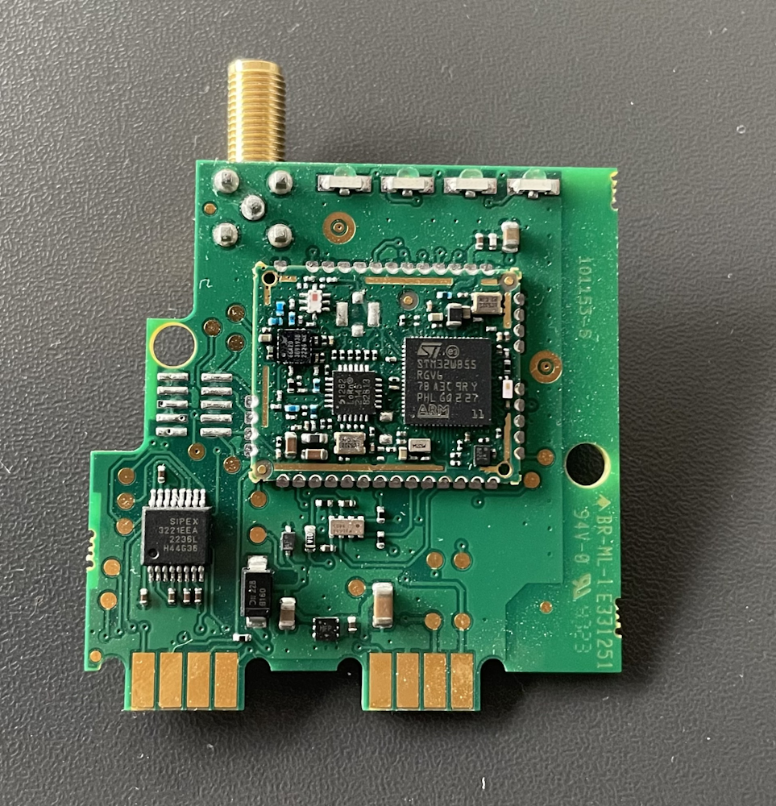
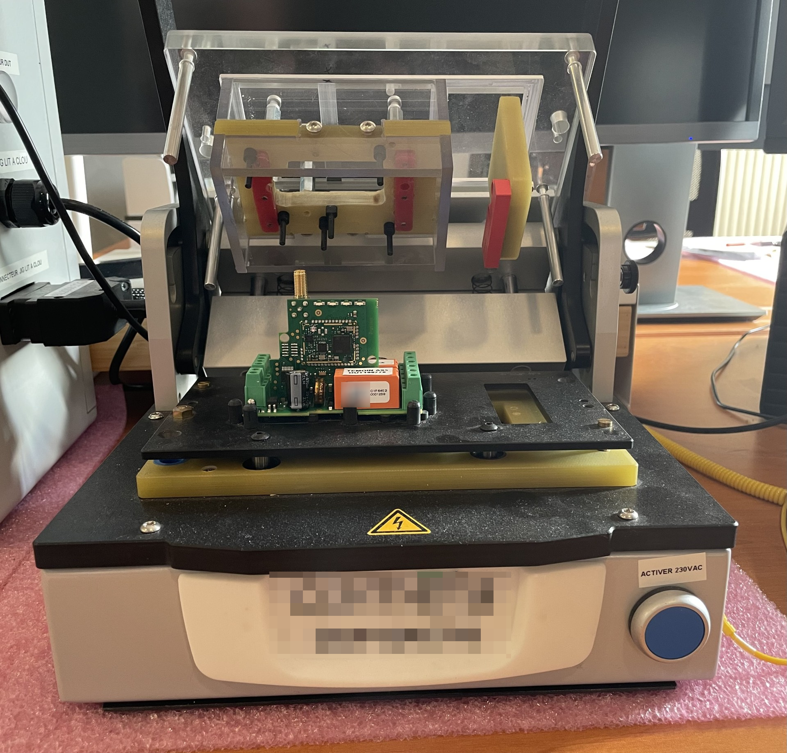
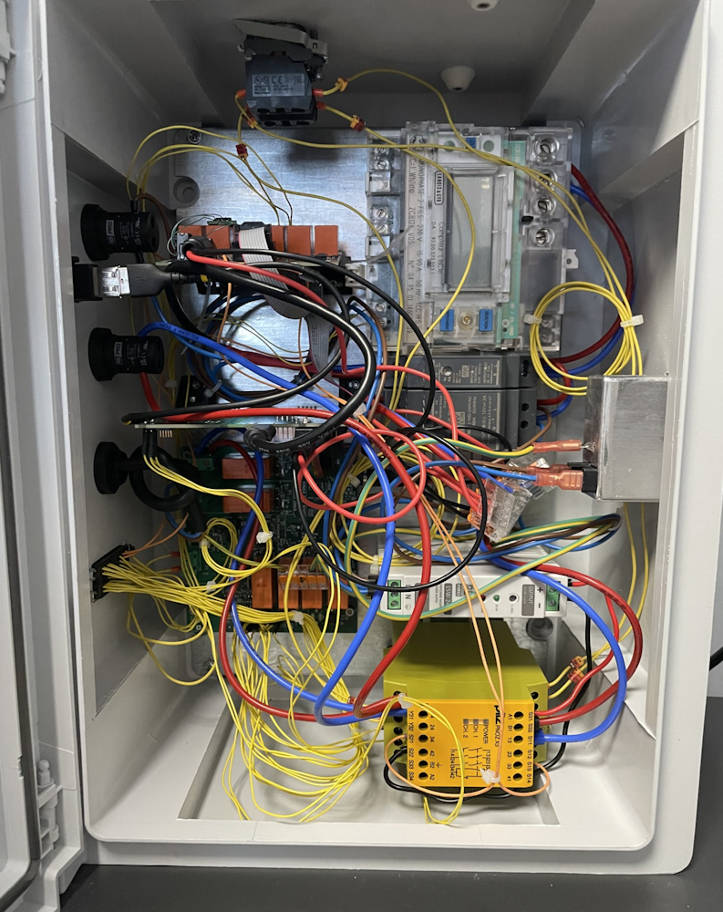
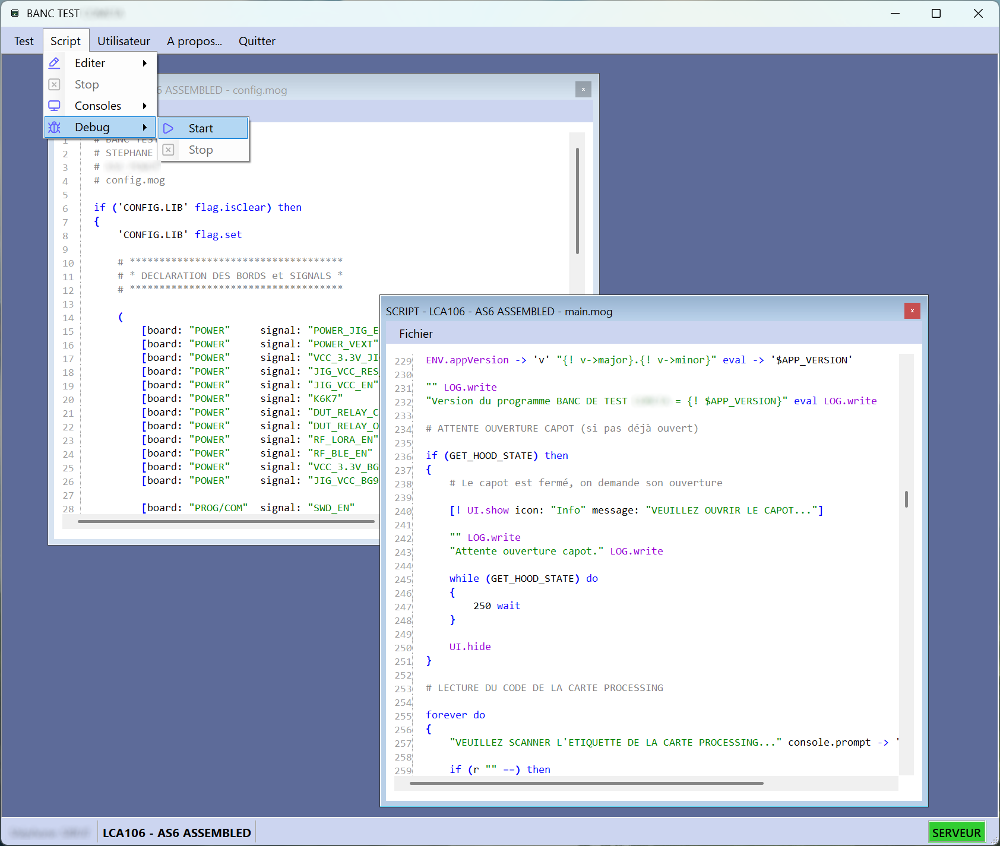

# MOGWAI in Production — Use Case #1
## Electronic Board Test Bench

---

## The Challenge

A manufacturer produces two product lines, each built from two electronic boards:

- A **power board** managing power supply.
- A **processing board** integrating the main CPU.



Product 1 uses **LoRaWAN + Bluetooth Low Energy**. Product 2 uses **4G + Bluetooth Low Energy**. Both board types are tested individually and as assembled products, yielding **five distinct test scenarios** — each comprising dozens of verification steps covering firmware, RTC, I/O, LEDs, power measurements, and more.

The engineering requirement was strict:

> One PC application must handle **all tests — present and future** — without ever being modified or recompiled. New tests must be deployable remotely, at subcontractor sites, without touching the host software.

In other words: a **frozen application, with living tests**.

---

## The Solution: Embedding the MOGWAI Runtime

The answer was to embed the **MOGWAI runtime** into the WinForm .NET test bench application.

Instead of hardcoding each test sequence in C#, each sequence is written as a MOGWAI script. The PC application becomes a pure **host**: it manages USB communication with the test fixture, exposes extended functions to the runtime (display, sounds, user interaction), and simply *runs* whatever script is loaded.

Adding a new test means dropping a new folder containing its MOGWAI files. Not a single line of C# needs to change.


---

## Architecture

```
PC Application (WinForm .NET)
│
├── MOGWAI Runtime (embedded)
│   ├── banc.mog              ← shared library for all tests
│   │
│   ├── Power board test/
│   │   ├── main.mog          ← test sequence
│   │   └── config.mog        ← fixture-specific parameters
│   │
│   ├── Processing board (LoRaWAN)/
│   │   ├── main.mog
│   │   └── config.mog
│   │
│   └── ... (3 more tests)
│
└── Host-exposed functions
    (USB serial, UI, logging, sounds, JLink...)
```

`banc.mog` is the backbone: a shared library containing every function common to all tests — fixture communication, JLink firmware programming, server interaction, conformity checks, and error handling.

Notably, the **communication protocol between the PC and the test fixtures was written entirely in MOGWAI** (`banc.mog`), not in C#. This means that if the fixture protocol ever changes, only the script is updated — the host application stays untouched.

---

## What MOGWAI Orchestrates

### Waiting for Fixture Power-On



Rather than using an arbitrary delay, MOGWAI performs a real measurement and waits for a valid response from the fixture:

```mogwai
to 'WAIT_FOR_POWER_ON' params [signal: .string] do
{
    false -> 'showWaitForPower'

    forever do
    {
        "AT+MEASURE:{! signal}" eval COM.cwrite
        [COM.mread timeout: 1000 expected: ("*")] -> 'r'

        if (r->state: "Success" !=) then
        {
            [UI.showModal icon: "error"
                message: "Communication error with the test fixture!"
                buttons: ("STOP")] drop
            mogwai.exit
        }
        else
        {
            if (r->answers: "Command fail" contains) then
            {
                if (showWaitForPower not) then
                {
                    true -> 'showWaitForPower'
                    [UI.show icon: "Warning"
                        message: "Please power the fixture..."]
                }
                1000 wait
            }
            else
            {
                if (showWaitForPower) then { UI.hide }
                break
            }
        }
    }
}
```

The loop polls the fixture over USB serial, displays an operator prompt if needed, and exits cleanly once power is detected — no guesswork, no hardcoded sleep.

---

### Firmware Programming via JLink Probe

MOGWAI drives the JLink probe directly to program the STM32WB55 microcontroller. The script generates the JLink command file dynamically, launches the external process, and waits for its exit code:

```mogwai
to 'JLINK_FW_PROGRAMMING' do
{
    (! path.home $JLINK_FOLDER $JLINK_SCRIPT_FILE) path.make -> 'jfile'

    (
        !
        "Erase 0x08000000 0x080B9FFF"
        "LoadFile {! $JLINK_FW_MASTER_FILE}"
        "Exit"
    ) D:0D0A ->ascii join ascii-> -> 'content'

    jfile content file.data.write

    [
        !
        PROCESS.start
        filename: $JLINK_PROGRAM
        arguments: "-AutoConnect 1 -ExitOnError 1 -device STM32WB55RG
                    -if swd -speed 2000 -CommandFile {! jfile}"
        workingDirectory: $JLINK_FOLDER
        wait: true
    ]

    trap { jfile file.purge }
}
```

The same mechanism handles BLE stack programming and option bytes — three independent functions, each generating its own JLink script on the fly from runtime variables.

---

### LED Colorimetric Verification

The bench verifies that indicator LEDs emit the correct colors. MOGWAI first calibrates the sensor (10 averaged readings), then checks each measurement against the expected RGB ranges:

```mogwai
to 'GET_LED' params [name: .string timeout: .number save: .boolean
                     rMin: .number rMax: .number
                     gMin: .number gMax: .number
                     bMin: .number bMax: .number] do
{
    [COM.mwrite command: "AT+LED:?" timeout: 5000
        expected: ("*,*,*,*")] -> 'result'

    result (answers: 0) get "," split -> 'result'

    result 0 get hex-> $LED_INIT_R - -> 'r'
    result 1 get hex-> $LED_INIT_G - -> 'g'
    result 2 get hex-> $LED_INIT_B - -> 'b'

    r rMin >= r rMax <= and -> 'rTest'
    g gMin >= g gMax <= and -> 'gTest'
    b bMin >= b bMax <= and -> 'bTest'

    if (rTest gTest bTest and and not) then
    {
        "Non-conformant!" LOG.write
        EXECUTE_ON_ERROR_FUNCTION
    }
}
```

---

### Server Resilience with Local Queue

When the server is unreachable, test results are not lost. MOGWAI serializes them into timestamped files and resubmits them automatically once the connection is restored:

```mogwai
# Server unavailable → queue locally
"LB-{! year}{! month}{! day}-{! hour}{! minute}{! second}.mog" content file.data.write

false -> '$SERVER_LAST_KNOWN_STATE'
'EVENT_SERVER_ERROR' null mogwai.sendMessage
```

A background sync process drains the queue whenever the server becomes available again.

---

### LoRaWAN Key Management

For LoRaWAN product tests, MOGWAI manages a local pool of provisioning keys (DevEUI, AppEUI, AppKey), fetched from the company server in batches and consumed one by one during testing:

```mogwai
to 'SERVER_GET_NEXT_KEY' do
{
    # Load or refresh the local key file
    # Extract the first available key
    # Refill the pool automatically when running low (< 10 keys)
    
    r 0 get -> 'k'
    r 0 purge -> 'r'
    "KEYS.DAT" r file.data.write

    if (r size 10 <) then
    {
        SERVER_FILL_KEY_FILE drop
    }

    k   # return the key
}
```

---

## Flexible Error Handling

Each test can define its own error behavior using a callback pattern:

```mogwai
# Register a custom error handler
ON_ERROR
{
    false UI.progress.setVisible
    [UI.showModal icon: "Error"
        message: "Board rejected — please remove and retry."
        buttons: ("OK")] drop
    mogwai.reset
}

# Later in the test: any failing check calls EXECUTE_ON_ERROR_FUNCTION,
# which dispatches to the registered handler.
```

If no custom handler is registered, MOGWAI falls back to a safe default: show an error dialog and exit cleanly.

---

## Results

| Metric | Value |
|---|---|
| Test scenarios | 5 (power board, processing ×2, assembled product ×2) |
| Verifications per test | Dozens (firmware, RTC, I/O, LEDs, voltages, BLE, LoRaWAN…) |
| Test duration | 2 to 10 minutes per board |
| In production since | October 2025 |
| Projected volume | Several thousand boards per year |
| Host application changes needed to add a new test | **Zero** |


---

## Key Takeaways

**Separation of concerns.** The host application is generic infrastructure. All test logic lives in scripts. This is not just a design preference — it was a hard requirement, and MOGWAI made it achievable.

**The protocol layer is a script too.** Moving the USB communication protocol from C# into `banc.mog` was a deliberate choice. If the fixtures evolve, only the script changes.

**Deployment is trivial.** New or updated tests are distributed as a folder containing `.mog` files. No installer, no recompilation, no IT intervention at subcontractor sites.

**MOGWAI STUDIO accelerates development.** The integrated debugger lets engineers step through multi-minute test sequences at full speed, set breakpoints, and inspect the stack — dramatically reducing bring-up time for new tests.

---

*→ [MOGWAI on GitHub](https://github.com/Sydney680928/MOGWAI)*
*→ [Try the online Playground](https://sydney680928.github.io/MOGWAI/)*
